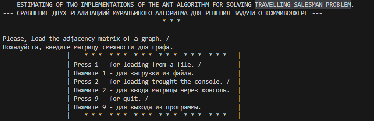
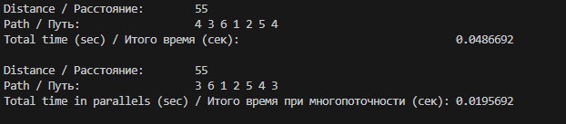

# Algorithms
Examples of applying different algorithms for solving some tasks.

### Ant algorithm

This algorithm helps solving **travelling salesman problem (TSP)** without and with multithreading.

**Input data:** adjacency matrix from file or console inputing, amount of repeating.

**Output data:** distance, found way, total time for both modes (without multithreding and with multithreading).

#### CPP example

This is a console application.

1. Move to the folder **cpp/**
2. Launch installation through make-tool:
```
make ant
```
3. After you can see the interface:



4. Load the adjacency matrix from the file or console, input the amount of algorythm repeating and you can see the result:

